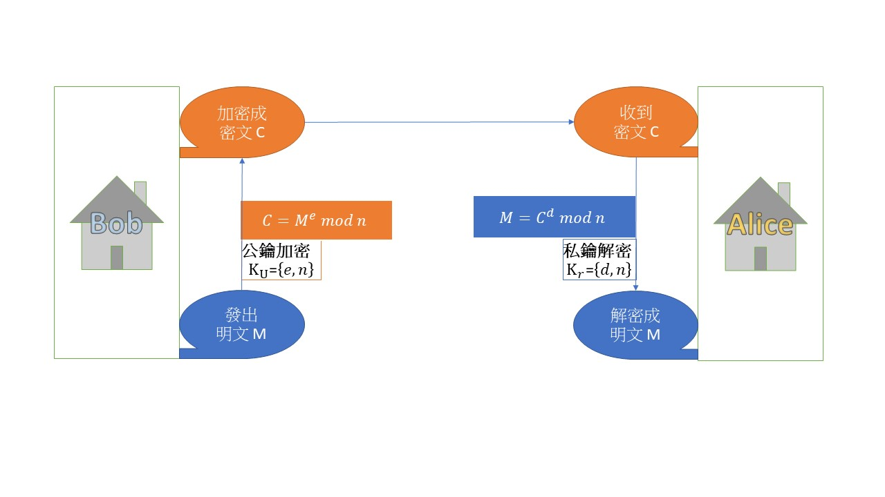

# 期中作業 - RSA 演算法

- 班級: 資工四
- 學號: 110710516
- 姓名: 蘇祐汝
  > 參考資料在最底

## 名詞解釋

- 非對稱加密:需要公鑰和私鑰分別做加解密。
- 對稱加密: 使用同個密鑰加解密
- [數字簽名](): 數據經過特定算法計算後得出的特殊標識，防止傳輸過程中被偽造篡改，是非對稱加密技術與數字摘要技術的綜合應用。
  - 數字摘要: 將任意長度的數據，通過一個摘要算法計算得到的固定長度的數據。通常結果要比原始短。典型摘要算法:MD5、SHA1
- [同餘指數 ≡](https://zh.wikipedia.org/wiki/%E5%90%8C%E9%A4%98):
  當兩個整數除以同一個正整數，若得相同餘數，則二整數同餘。
- [單向暗門](https://ithelp.ithome.com.tw/m/articles/10225764):給定暗門函數 f(x)，使 y
  容易算出，但難以回推算出 x
- 質數 P: 除了 1 和該数自身外，無法被其他自然数整除的数
- 互質數: 兩個或兩個以上的整數的最大公因數是 1
- [φ 尤拉定理(Euler Theorem)](https://ithelp.ithome.com.tw/articles/10250721): 若 n,a
  為正整數，且 n,a 互質，則$a^{φ(n)}≡ 1 mod n$，即$a^{φ(n)}$與 1 在模(n)下同餘，則$φ(n)$為尤拉函數。

# RSA 演算法

## 介紹

RSA 加密演算法是一種`非對稱加密演算法`。目前最有影響力和最常用的公鑰加密算法，能夠抵抗到目前爲止已知的絕大多數密碼攻擊，已被 ISO
推薦爲公鑰數據加密標準。

RSA 是由羅納德·李維斯特（Ron Rivest）、阿迪·薩莫爾（Adi Shamir）和倫納德·阿德曼（Leonard Adleman）在 1977
年一起提出的。當時他們三人都在麻省理工學院工作。RSA 就是他們三人姓氏開頭字母拼在一起組成的。

## 操作原理

> 使用區塊加密法，且鑰匙與區塊明文的長度必須相同（512,1024 ...bits）。

- 明文區塊被加密成相同長度的密文區塊，每一區塊的數值小於某個整數 n，表示區塊的大小必須小於或等於 log2(n)位元，若區塊大小為 k 個位元 :
  `2k < n < 2k+1`
- 明文 M
- 密文 C
- 公開鑰匙 $K_U = \lbrace e, n \rbrace$ ，加密者必須知道數值 e
- 私有鑰匙 $K_R = \lbrace d, n \rbrace$ ，只有解密者知道數值 d
- 兩把鑰匙可以相互加密或解密
- 加密：$ C ≡ M^e mod \quad n $
- 解密：$ M ≡( C^d mod \quad n )≡((M^e)^d mod \quad n )≡ (M^{ed} mod \quad n) $
  

### [公私鑰的產生](https://ithelp.ithome.com.tw/articles/10250721)

> 利用`同餘指數`，推演出公開與私有鑰匙配對，並能完全合乎`單向暗門`的需求。

1. 隨意選擇兩個大的質數 p, q ，兩者不相等，計算 $N=pq$
2. 根據尤拉函數:$$ r = φ(N) = φ(p) \* φ(q) = (p-1)(q-1)$$
3. 選擇一個小於 r 的整數 e，使 e 與 r 互質。並求得 e 關於 r 的模反元素，命名為 d（求 d 令 ed ≡ 1 (mod
   r))。（模反元素存在，當且僅當 e 與 r 互質）
4. 將 p, q 銷毀 

## 計算範例

### 產生公私鑰

1. 選定兩個質數，p = 7、q = 17。計算 `n = pq = 7 × 17 = 119`。
2. 計算$ψ(n) = (p-1) × (q-1) = 6 × 16 = 96$
3. 選定 e 滿足 gcd(e, ψ(n)) =1，假設選擇 `e = 5`，因與 96 互質。\
   (備註：由 3, 5, 7, … 質數開始測試是否滿足)
4. 尋找 d，其中 d < 96 且必須滿足 de ≡1 mod 96。本範例找到 `d = 77`，因為 77×5 = 385 ≡1 mod 96
   (備註：de/96 = 商 .. 餘數 1，則 d×5 = (96×y) +1，由 y=1, 2, 3, .. 開始測試)
   - 公開鑰匙：$K_U = \lbrace e, n \rbrace = \lbrace 5, 119 \rbrace$
   - 私有鑰匙：$K_R = \lbrace d, n \rbrace = \lbrace 77, 119 \rbrace$

### 加解密運作

- 加密: `明文 M = 19`，$ C ≡ M^e mod \quad n ≡ 19^5 mod 119 ≡ 66 mod
  119$，得出`密文 C = 66`

```
演算過程如下：
19^2 = 361 ≡ 4 mod 119
19^4≡ 4 × 4 = 16 ≡ 16 mod 119
19^5 = 19^4× 19^1≡16 × 19 = 304 ≡ 66 mod 119
```

- 解密: `密文 C = 66`，$ M ≡( C^d mod \quad n ) ≡ 66^{77} mod 119 ≡ 19 mod
  119$，得出`明文 M = 19`

```
演算過程如下：
66^2 = 72 mod 119
66^4 = 72 × 72 = 5184 = 67 mod 119
66^8 = 67 × 67 = 4489 = 86 mod 119
66^16 = 86 × 86 = 7396 = 18 mod 119
66^32 = 18 × 18 = 324 = 86 mod 119
66^64 = 86 × 86 = 7396 = 18 mod 119
66^77 = 66^64 × 66^8 × 66^4 × 66
= 18 x 86 x 67 x 66
= 6845256 = 19 mod 119
```

## 程式碼

fork 自 [github:rzcoder/node-rsa](https://github.com/rzcoder/node-rsa)
[練習紀錄](https://github.com/ukarara/sa110a/tree/master/Mid/RSATest.md)

### 優點

- 安全性高

### 缺點

- 解密時間長
- 對原文長度有限制

## 應用

大多運用於密鑰交換與數位簽章兩大方面。

- 隱藏原文(所有加密算法的通用功能)
- 防止原文被篡改(數字簽名)
- 身份認證
- 蠕蟲病毒
- 電商
- 金融卡

# 參考資料

[翻轉工作室](http://www.tsnien.idv.tw/Security_WebBook/chap3/3-4%20RSA%20%E6%BC%94%E7%AE%97%E6%B3%95.html)
[WIKI](https://zh.wikipedia.org/wiki/RSA%E5%8A%A0%E5%AF%86%E6%BC%94%E7%AE%97%E6%B3%95)
或是標題連結前往~
