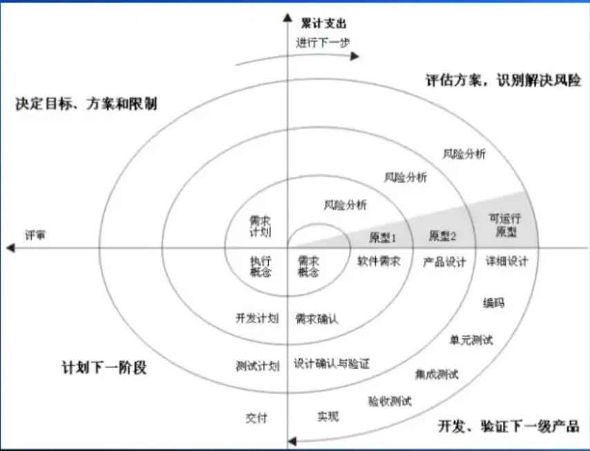

# W1 介紹
* 軟體工程 : javascripe + deno
    * 專案管理
        * 瀑布模式
        * 螺旋模式

* 演算法 : javascripe + deno
    * Plant UML
    * nginx
    * Docker
* 補:作業系統 : C
    * RISCV

[用20分鐘搞懂 《系統分析、軟體工程、專案管理與設計模式》](https://www.slideshare.net/ccckmit/20-57269452)