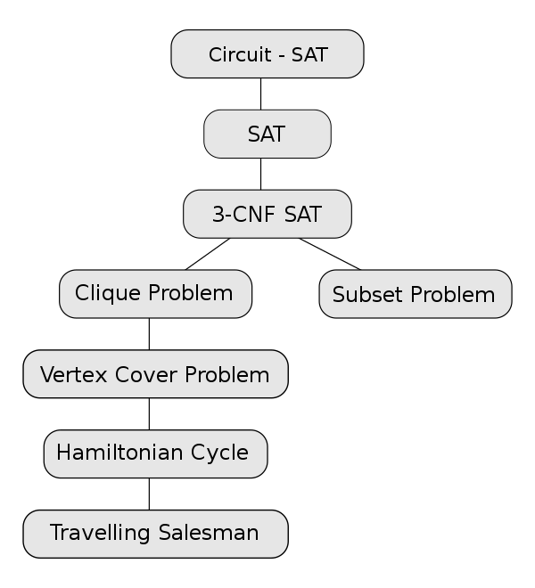

# W17 計算理論([課程ppt](https://www.slideshare.net/ccckmit/ss-56891871))
Stephen A. Cook 提出 NP-Complete問題開始

## NP-Complete
>以決定性命題表示的著名NPC問題


## 方法
* 遞增法: (1+...+n),迴圈計算
* 記憶法: 排序搜尋雜湊
* 枚舉法(Enumeration): 列出解答再驗證，拼圖法/八皇后
* 遞歸法(recursive): 分治法
* 分治法: 大問題變成小問題解決再組合
* 動態規劃法: 最短路徑問題
* 貪心法(Greedy algorithm): 
* 規約法([reduction): 將A轉成B問題,套用B的解法解決再轉回去,eg: 邏輯滿足問題

## 羅素理髮師悖論
>「只為城裡所有不為自己理髮的人理髮」；但「一定要為城裡所有不為自己理髮的人理髮」
>>理髮師該為自己理髮嗎？

## 圖靈停止問題
>寫成是判斷另一程式會不會停，停止輸出1，不會輸出0
isHalt(code, data)=1 if code(data)會停
                  =0 if code(data)不停
```python
funtion U(data):
    if (isHalt(code, data)==1)
        loop forever
    else
        halt
```
## 哥德爾不完備定理
>不存在一個機器方法，可以正確計算「包含算術的一階邏輯字串」是否為定理
```python
funtion Proveable(str):
    if (str is a theorem)
        return 1
    else
        return 0  
```

## unsolvable (sa\alg\18-unsolvable)
### [isHalt](sa\alg\18-unsolvable\halt\isHalt.js)
```PS 
> deno run halt.js
isHalt(f1,3)= true
...當機
```

## 規約法(sa\alg\16-reduction)
### [YASMIJ](https://github.com/LarryBattle/YASMIJ.js/)

## npcomplete(sa\alg\17-npcomplete)
### sat.js(sa\alg\17-npcomplete\SAT\sat.js)
>可以解決,需要很長時間運算  
```PS
> node sat.js   
exp= (x||y)&&(!x||!z)&&(x)&&(y)
values= []
values= [ 0 ]
values= [ 0, 0 ]
values= [ 0, 0, 0 ]
{"x":0,"y":0,"z":0} => 0
values= [ 0, 0, 1 ]
{"x":0,"y":0,"z":1} => 0
...
values= [ 1, 1 ]
values= [ 1, 1, 0 ]
{"x":1,"y":1,"z":0} => 1
... ...
```

###  expEval(sa\alg\17-npcomplete\SAT\expEval.js)
```PS
> deno run expEval.js
exp= (x||y)&&(x||!z)  assign= { x: false, y: true, z: true }  result= false
> deno run expEval.js
exp= (x||y)&&(x||!z)  assign= { x: true, y: true, z: true }  result= true
```

## greedy (sa\alg\10-greedy)
### [huffmanCode](sa\alg\10-greedy\huffmanCode)
```PS
> node huffmanCode.js
encode= {
  emap: {
    '1': '10001',  
    '2': '1000000',
    '3': '100001', 
    T: '0',        
    a: '1000001',
    c: '10010',
    b: '10011',
    S: '101',
    E: '11'
  },
  result: '0111010011101001110100111010011101001110100111010011101010001100000010000110000011001110010'
}
decode= TESTTESTTESTTESTTESTTESTTESTTEST123abc
```
## string(sa\alg\13-string)
### [KMP演算法](sa\alg\13-string\knuth-morris-pratt)
>Knuth-Morris-Pratt字串尋找演算法（簡稱為KMP演算法）可在一個字串S內尋找一個字W的出現位置。一個詞在不匹配時本身就包含足夠的資訊來確定下一個匹配可能的開始位置，此演算法利用這一特性以避免重新檢查先前配對的字元。 [wiki](https://www.bing.com/search?q=knuth-morris-pratt&cvid=39b513f739b946dbbcbc3a2187e6773b&aqs=edge..69i57j0l8.362j0j4&FORM=ANAB01&PC=ASTS)
```
> deno run kmpTest.js
kmp(she sells seashells by the seashore, shell) =  13
kmp(she sells seashells by the seashore, seaweed) =  -1
```

## 幾何學(sa\alg\15-geometry)
### [geometryTest](sa\alg\15-geometry)
外積: 
```js
// 叉積 a0*b1-a1*b0 (只適用於二維向量)
export function cross(a,b) {
  return a[0]*b[1]-a[1]*b[0]
}

cross(V.sub(p2, p0), V.sub(p1, p0))
```
```PS 
> deno run geometryTest.js
Check .../geometryTest.js
direction(p0, p1, p2)= 1
intersect(p0, p1, p2, p3)= true //(p0, p1)(p2, p3)是否相交
```

### 凸包[Convex Hull](sa\alg\15-geometry)
>將外圍所有點順時鐘或逆時鐘連起來，能包裹住所有點。
閱讀補充資料 'Graham's scan'

```PS
> deno run convexTest.js     
[ [ -1, -1 ], [ 1, 0 ], [ 1, 1 ], [ 0, 1 ] ]
```


------------
## 補充資料
[KMP算法詳解](https://medium.com/nlp-tsupei/kmp%E7%AE%97%E6%B3%95%E8%A9%B3%E8%A7%A3-1b1050a45850)
計算凸包: 葛立恆掃描法[（Graham's scan）](https://zh.wikipedia.org/wiki/%E8%91%9B%E7%AB%8B%E6%81%86%E6%8E%83%E6%8F%8F%E6%B3%95)