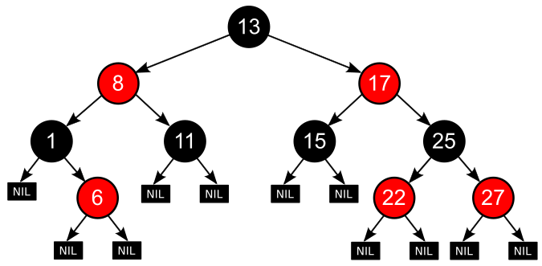

# W2 查表法、單元測試

## 費式數列fibonacci
### (SA\sa\alg\01-tableLookup\fiboanacci)
>f(n)=f(n - 1) + fibonacci(n - 2)  
f(1)=1  
f(0)=0

>! : n值若太大,結果會有誤差,因為浮點數精度
* fibonacci:遞迴
```JS
function fibonacci (n) {
  if (n < 0) throw Error('fibonacci:n < 0')
  if (n === 0) return 0
  if (n === 1) return 1
  return fibonacci(n - 1) + fibonacci(n - 2)
}
```
```
> deno run fibonacci.js
fibonacci(40)=102334155
time:1972ms
```
* fibonacci_lookup:遞迴(改良)
```JS
function fibonacci (n) {
  if (n < 0) throw Error('fibonacci:n < 0')
  if (fib[n] != null) return fib[n] /*重點*/
  fib[n] = fibonacci(n - 1) + fibonacci(n - 2)
  return fib[n]
}
```
```
> deno run fibonacci_lookup.js
fibonacci(40)=102334155
time:8ms
```
* fibonacci_loop:迴圈
## 翻譯系統 -- 查表法 (逐字翻譯)
### (SA\sa\alg\01-tableLookup\mt\e2c.js) 
```PS
> deno run e2c.js a dog cat
[ "一隻", "狗", "貓" ]
> deno run e2c.js a cat chase dog
[ "一隻", "貓", "追", "狗" ]
```

## 紅黑樹   from: [wiki](https://zh.wikipedia.org/wiki/%E7%BA%A2%E9%BB%91%E6%A0%91)

* 二叉查找樹
* 要求：
    1. 節點是紅色或黑色。
    2. 根是黑色。
    3. 所有葉子都是黑色（葉子是NIL節點）。
    4. 每個紅色節點必須有兩個黑色的子節點。（從每個葉子到根的所有路徑上不能有兩個連續的紅色節點。）
    5. 從任一節點到其每個葉子的所有簡單路徑都包含相同數目的黑色節點。

* 操作時間 : O(log n)次。


補充教材 : [教學ppt](https://www.csie.ntu.edu.tw/~hsinmu/courses/_media/dsa1_10fall/lecture15.pdf)、[紅黑樹介紹](https://tigercosmos.xyz/post/2019/11/algorithm/red-black-tree/)

## 傾斜二元樹
當二元樹的每一階都各只有一個節點時，其節點個數最少，故高度為 h
之二元樹的最少節點個數為 h  


## 巴斯卡三角形 from : [WIKI](https://zh.wikipedia.org/wiki/%E6%9D%A8%E8%BE%89%E4%B8%89%E8%A7%92%E5%BD%A2)

* 組合恆等式 : 
>C(n+1)(k+1) = c(n,k) + c(n, k+1)
### (sa\alg\01-tableLookup\combinatorial)
* CnkR:遞迴  
c(60,30)數字太大就會當機
>c(n, k)=c(n-1, k) + c(n-1, k-1)
* CnkRLookup :查表法  
降低遞迴的負擔,費時縮短
```JS
function c(n, k) {
  if (C[n] == null) C[n] = []
  if (C[n][k] != null) return C[n][k] //已經查到
  if (k==0 || k==n)
    C[n][k] = 1
  else 
    C[n][k] = c(n-1,k) + c(n-1, k-1)  //查不到用遞迴算
  return C[n][k]  //算完放進表內
}
```

## lodash
### (SA\sa\se\02-test\js\00-uselodash~02-helloTest)
```PS
> deno test add_test.js
running 1 test from file:///D:/110-2Note/SA/sa/se/02-test/js/02-helloTest/test/add_test.js
test add test ... ok (21ms)

test result: ok. 1 passed; 0 failed; 0 ignored; 0 measured; 0 filtered out (51ms)
```
## TDD & BDD
使用deno附的測試 : [deno_tdd_bdd](https://deno.land/x/tdd@v0.6)
### (SA\sa\se\02-test\js\05-tdd2)
1. TDD
先寫測試再寫函數開發，難以產生報告，不利於非技術人員開發
### (SA\sa\se\02-test\js\06-bdd)
2. BDD 
測試前先用自然語言寫測試規格書。測試規格書可以被執行，也就是可以被轉成自動化測試。

## 測試速度
### (SA\sa\se\02-test\js\08-bench\bench1.ts)
```PS
> deno run bench1.ts
running 1 benchmark ...
benchmark forIncrementX1e9 ...
    584ms
benchmark result: DONE. 1 measured; 0 filtered
----------------------------------------------------------
> deno run bench2.ts
running 1 benchmark ...
benchmark runs100ForIncrementX1e6 ... 
    100 runs avg: 0.42ms
benchmark result: DONE. 1 measured; 0 filtered
```
## 看報表
### (SA\sa\se\02-test\js\09-metrics)
```PS
> deno run metrics1.js
hello!
┌─────────────────────────┬────────┐
│ (idx)                   │ Values │
├─────────────────────────┼────────┤
│ opsDispatched           │      1 │
│ opsDispatchedSync       │      1 │
│ opsDispatchedAsync      │      0 │
│ opsDispatchedAsyncUnref │      0 │
│ opsCompleted            │      1 │
│ opsCompletedSync        │      1 │
│ opsCompletedAsync       │      0 │
│ opsCompletedAsyncUnref  │      0 │
│ bytesSentControl        │      0 │
│ bytesSentData           │      0 │
│ bytesReceived           │      0 │
└─────────────────────────┴────────┘
```
- - - - - 
## 補充資料
[BigInt](https://developer.mozilla.org/zh-TW/docs/Web/JavaScript/Reference/Global_Objects/BigInt)、
[浮點數的運算誤差](https://dotblogs.com.tw/daniel/2018/11/10/161148)、
[lodash](https://lodash.com/)、
[chai](https://www.chaijs.com/)、
[BDD/TDD差別](https://tw.alphacamp.co/blog/bdd-tdd-cucumber-behaviour-driven-development)