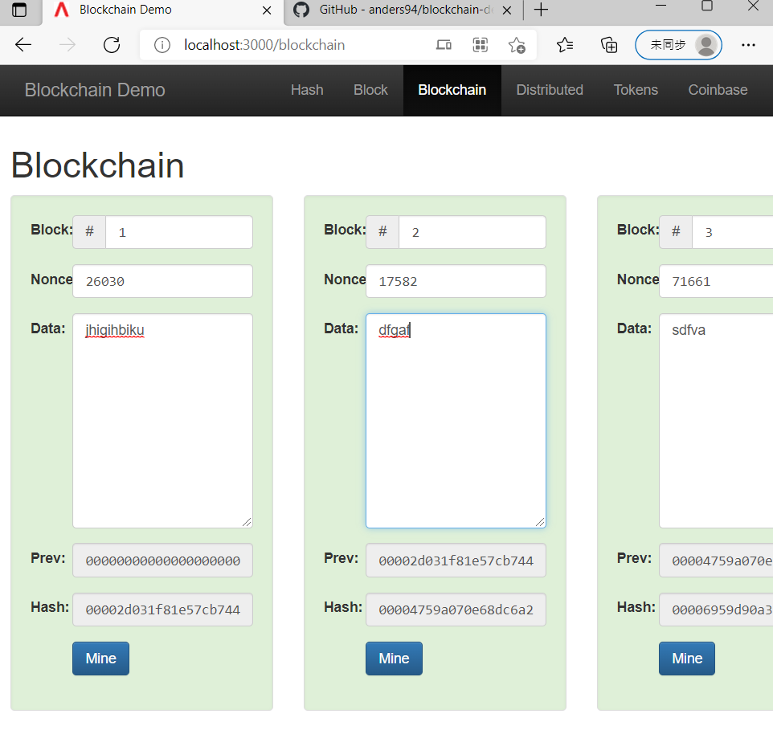
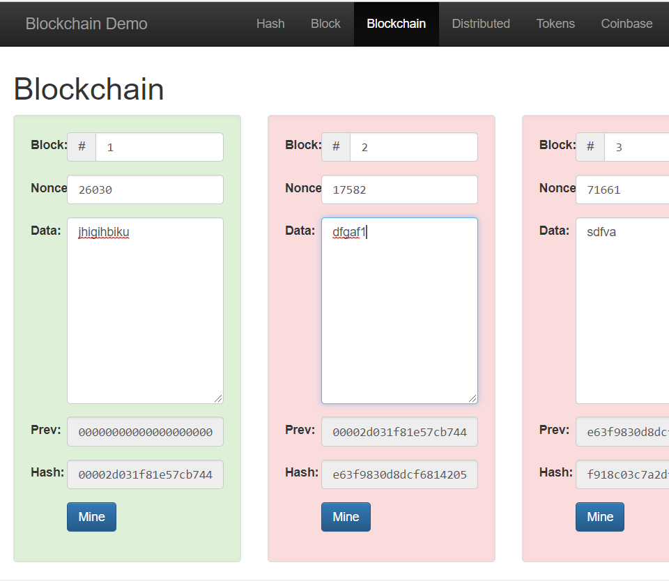

# W5 雜湊，暴力法，區塊鏈
## 亂數產生法
### guid(sa\alg\02-random\guid\guid.js)
> guid 是屬於 uuid 的一種變形，主要目的還是用來識別以及作為唯一識別使用。
```
> deno run guid.js
15227ca2-cc3e-47fe-c341-163f20731c48
> deno run guid.js
33054375-a3e1-6c45-883d-54e29ce0b708
> deno run guid.js
3552efbe-085c-87c5-a5bc-1ef8b09d8bae
```

### uuid(sa\alg\02-random\guid\uuid.js)
>大家電腦中的 MAC address 就是一個很典型的 uuid 格式，主要型態為，8-4-4-4-12 總字串數為 36 字串長度，前面是採用 16 進位方式產生，最後面兩個串數字為序列式的 byte 字元。
```
PS D:\110-2Note\SA\sa\alg\02-random\guid> deno run uuid.js
8631b9a6-eaa7-48df-b12a-17cdde5a6637
PS D:\110-2Note\SA\sa\alg\02-random\guid> deno run uuid.js
3ba2e8d4-5b5b-4dc0-bff2-31e36a8c2fd4
PS D:\110-2Note\SA\sa\alg\02-random\guid> deno run uuid.js
0ebac4d8-5994-4ebe-a790-a2482eba2530
```
## 雜湊 hashing
### (sa\alg\07-hashing\hashtable)
```
> deno run hash1.js
hashCode(hello)= 99162322
hashCode(hello!)= -1220935281
hashCode(hello world !)= 1854031301

> deno run hash2.js
hash(hello)= acfa3a7
hash(hello!)= c21a8b86
hash(hello world !)= 316d7444
```
### 雜湊表(sa\alg\07-hashing\hashtable)
```js
let ht = new HashTable(127) //hashtable長度最好質數,可減少碰撞
```
```
> deno run hashtable.js
get(ccc)= { key: "ccc", value: "ccckmit@gmail.com" }
get(garfield)= undefined
get(ccc)= undefined
```
### Sha加密 (sa\alg\07-hashing\sha)
>加密常用 "sha256"   
2^256數值極大,基本上不會碰撞
* hash.js
```js
function hash(text) {
  const h = createHash('sha256') 
  h.update(text)
  return h.toString()
}
```
```
> deno run hash.js
hash(hello)= 2cf24dba5fb0a30e26e83b2ac5b9e29e1b161e5c1fa7425e73043362938b9824
hash(hello!)= ce06092fb948d9ffac7d1a376e404b26b7575bcc11ee05a4615fef4fec3a308b
hash(hello world !)= a4bf1f6be616bf6a0de2ff6264de43a64bb768d38c783ec2bc74b5d4dcf5f889
```
* digest.js
```JS
let record = {
  nonce: 0,     //挖礦挖nonce
  data: 'john => mary $2.7',
}
```
```
> deno run digest.js   
json= {
  "nonce": 0,
  "data": "john => mary $2.7"
}
digest= cde91f9fdaf2ad6d01d07bb2836f3f6640556232660faa3731c47ebf86683cb8
```
## 暴力搜尋法
>比特幣挖礦就是一種暴力搜尋法
### 比特幣 (sa\alg\08-bruteForce\bitcoin)
```
> deno run mining.js
{
  record: { nonce: 169321, data: "john => mary : $2.7; george => john : $1.3" },
  hash: "000008fe6609d98812d5371c271640c2c3e9658f425d0cb4bc1eb5d7b1f653d1"      
}
```

### clone [ 區塊鍊 blockchain-demo](https://github.com/anders94/blockchain-demo)
1. 
```
> git clone https://github.com/anders94/blockchain-demo.git
> cd blockchain-demo
> npm install
> npm start
blockchain-demo@0.0.1 start
node ./bin/www
```
2. 打開網頁輸入" http://localhost:3000/blockchain " 進入區塊鏈  
* 區塊鏈具有不能篡改性  
  

