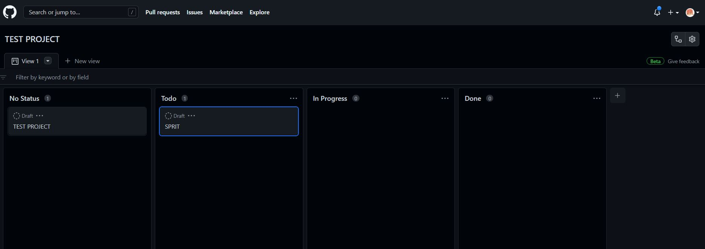

# W7 專案合作與管理

## 軟體管理

- 瀑布模式
- V 模式
- 螺旋模式
- 快速雛形
- 敏捷開發

### 敏捷開發

- 方法
  - 結對編程 (Pair Programming)
  - 測試驅動 (TDD/BDD)
  - 持續整合 (Continuous Integration)
  - 軟體重構 (Refactor)
  - 開發運維一體化 (DevOps)

### 時程掌控:

- 簡單就好
  - 看板+立可貼 (github-project 可以創建 board 模板)
  - Burndown Chart (燃盡圖) 
  - 使用微軟 Excel
- 每個功能應該包含多項工作
- 只有實際要寫該程式的程式員才能排出該項的時程
- 把工作分得很細
- 記錄最初和目前的估計
- 每天更新耗時(elapsed)欄位 (或畫在燃盡圖上)
- 加上國定假日，休假等等項目
- 把除錯時間排入時程！
- 把整合 (Integration) 時間排入時程中
- 在時程中加上緩衝時間
- 絕對不要讓經理叫程式員縮減估計時間
- 時程就像積木，時程來不及只能縮減開發項目，或者延長時程，但不能硬塞或壓縮。

### 開發的過程與產出

如果以 UML 的角度，整個系統開發過程，通常會有下列產出。

- 需求分析：需求定義 => Use Case (User Story) => 系統架構 (Architecture)
- 系統分析：粗略類別圖 => 粗略循序圖 => (合作圖 , 狀態圖, 物件圖)
- 系統設計：精緻類別圖 => 精緻循序圖 => (套件圖、元件圖、佈署圖) => UI 畫面
- 程式實作：程式碼、資料庫
- 測試驗證：單元測試、整合測試、系統測試

當然其中有些會依專案不同而調整，例如若採用 TDD ，那麼應該《先寫測試再寫程式》，很多人也會《一邊寫測試一邊寫程式》

### 更新日誌

- 通常更新日誌最新的版本在上面，最舊的在下面。
- 通常日期採用 'YYYY-MM-DD' 這種規範。
- 每一個軟體的版本標記修改類型：
  - Added : 添加新功能
  - Changed : 功能變更
  - Deprecated : 未來會刪除某些功能
  - Removed : 刪除了某些功能
  - Fixed : 修正的 bug
  - Security: 修正了安全相關的 bug

## 品質控管

> 《可讀性、容錯性、擴充性》

- 程式碼排版: 像 VSCode 的 prettier 套件，`shift+alt+F`即可格式化文件使其美觀易讀；或是 terminal 輸入`deno fmt name.js`也可進行排版。
- BUG 管理: 語法檢查器難以檢查所有錯誤像是語意或邏輯錯誤，

- 自動化管理[git hook](https://gitlab.com/ccc110/sa/-/tree/master/se/10-auto/githook): 在專案資料夾進入.git/hooks(可能被隱藏) ，選擇 pre-commit.sample 檔案刪掉檔名中的 sample 並加入以下內容:

```
#!/bin/sh
deno fmt */*.ts */*.js */*.md   #對.ts.js.md進行排版
echo format Hook    #回復format Hook
# exit 1
```

每次進行 commit 時:

```PS
> git commit -m 'test hook'
\\?\SA\sa110a\Mid\README.md
\\?\SA\sa110a\Final\README.md
\\?\SA\sa110a\W2_HW\ReadMe.md
Checked 3 files
format Hook //就會回復您
```

## 系統分析

進一步細分為:

1. 可行性分析：確認專案目標以及可行性。
2. 需求分析：探詢並列出專案需求。
3. 系統分析：將需求規格化，讓設計人員可以掌握需求，不會誤解。這樣才能進一步進行《系統設計》。

.

## 使用者故事 User Story

敏捷開發中建議使用 User Story 描述需求，
以下是經典網誌系統 BlogMVC 的 User Story :
BlogMVC: User Story

- 使用者可以檢視全部貼文列表
- 使用者可以新增一筆貼文
  - 貼文按照新增時間由舊到新列出
- 使用者可以檢視單一貼文內容
  - 包含標題 title 與內容 content

* http://plantuml.com/use-case-diagram

```
@startuml
left to right direction
使用者 --> (檢視貼文列表)
note right of (檢視貼文列表)
 貼文按照新增時間由舊到新列出
end note

使用者 --> (新增貼文)

使用者 --> (檢視貼文內容)
note right of (檢視貼文內容)
 包含標題 title 與內容 content
end note
@enduml
```

.

## XV6

UNIX 第六版的重新實現

### 使用方法

- clone xV6 [老師專案](https://github.com/riscv2os/xv6)、[MIT 原版](https://github.com/mit-pdos/xv6-riscv)
- 安裝[SIFIVE](https://www.sifive.com/software)
- 解開 FreedomStudio 壓縮檔後，將 windows 的 PATH 加入 `riscv64-unknown-elf/bin` and `riscv-qemu/bin` 這兩個路徑 (我電腦中的路徑如下)。

```
D:\FreedomStudio-4.18.0.2021-04-1-x86_64-w64-mingw32\SiFive\riscv64-unknown-elf-toolchain-10.2.0-2020.12.8\bin

D:\FreedomStudio-4.18.0.2021-04-1-x86_64-w64-mingw32\SiFive\riscv-qemu-5.1.0-2020.08.1\bin
```

然後請用 git-bash 編譯建置你的專案。(我用 Visual Studio Code 中的終端機)

```bash
$ choco install make  //下載 make 指令
$ make
$ make qemu
...
balloc: write bitmap block at sector 45
qemu-system-riscv64 -machine virt -bios none -kernel kernel/kernel -m
256M  -smp 3 -nographic -drive file=fs.img,if=none,format=raw,id=x0 -device virtio-blk-device,drive=x0,bus=virtio-mmio-bus.0  //-smp 3 代表有3個核心

xv6 kernel is booting //第0個核心

hart 2 starting //第一個核心(真正的作業系統)啟動
hart 1 starting //第二個核心啟動
$ ls
.              1 1 1024
..             1 1 1024
README         2 2 2102
cat            2 3 24504
echo           2 4 23328
forktest       2 5 13456
grep           2 6 27808
init           2 7 23968
kill           2 8 23296
ln             2 9 23128
ls             2 10 26704
mkdir          2 11 23424
rm             2 12 23416
sh             2 13 42136
stressfs       2 14 24288
usertests      2 15 154648
grind          2 16 38328
wc             2 17 25616
zombie         2 18 22672
console        3 19 0
```

- cat 顯示 README 內容， grep 只顯示關於 xv6 的段落

```bash
$ cat README | grep xv6
xv6 is a re-implementation of Dennis Ritchie's and Ken Thompson's UnixVersion 6 (v6).  xv6 loosely follows the structure and style of v6,
xv6 is inspired by John Lions's Commentary on UNIX 6th Edition (Peer
The code in the files that constitute xv6 is
(kaashoek,rtm@mit.edu). The main purpose of xv6 is as a teaching
```

- 打印文件資訊: 44 行 295 words 2102 letters

```bash
$ wc readme
  44  295 2102 readme
```

### 系統講解

[xv6 電子書](https://github.com/riscv2os/riscv2os/wiki/xv6CATWRITE)

clone [mini-riscv-os](https://github.com/riscv2os/mini-riscv-os)

- HelloOs(mini-riscv-os/01-HelloOs)
  - start.s

```S
_start:
    # setup stacks per hart
    csrr t0, mhartid                # read current hart id
    slli t0, t0, 10                 # shift left the hart id by 1024
    la   sp, stacks + STACK_SIZE    # set the initial stack pointer
                                    # to the end of the stack space
    add  sp, sp, t0                 # move the current hart stack pointer
                                    # to its place in the stack space

    # park harts with id != 0
    csrr a0, mhartid                # read current hart id
    bnez a0, park                   # if we're not on the hart 0
                                    # we park the hart

    j    os_main                    # hart 0 jump to os.c os_main()

```

- os.c

```C
int os_main(void)
{
	lib_puts("Hello OS!\n");
	while (1) {}
	return 0;
}
```

結果

```bash
/mini-riscv-os/01-HelloOs (master)
$ ls
Makefile  os.c  os.elf  os.ld  README.md  start.s
$ make qemu
Press Ctrl-A and then X to exit QEMU
qemu-system-riscv32 -nographic -smp 4 -machine virt -bios none -kernel os.elf
Hello OS! // 印出了 Hello OS!
```
